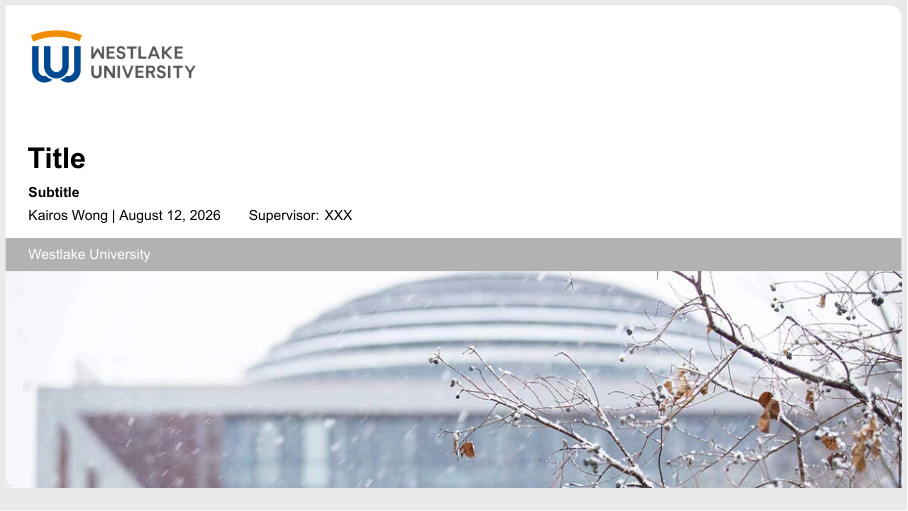
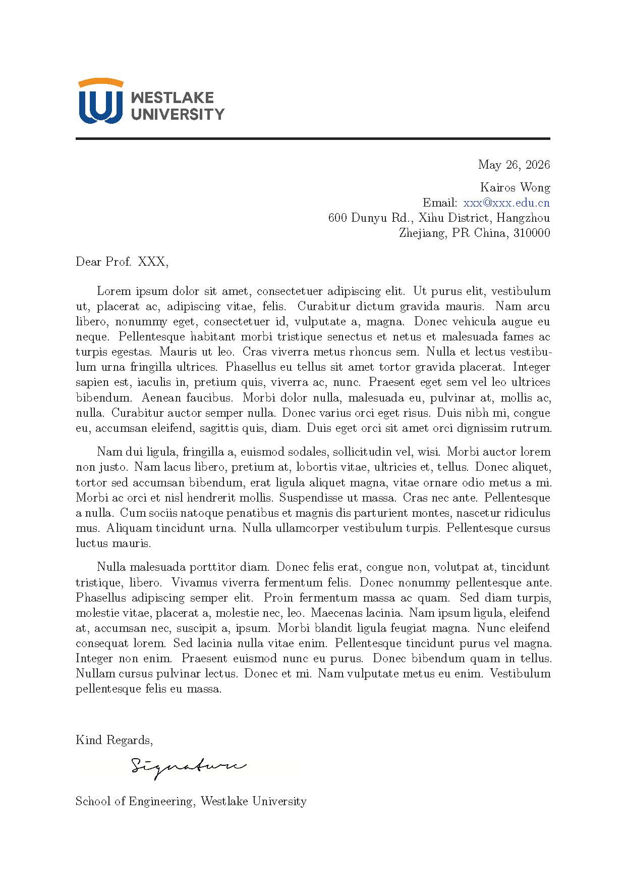
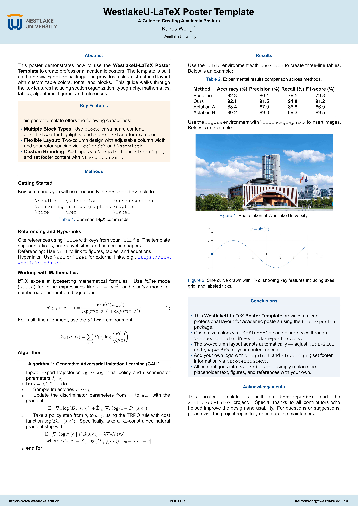
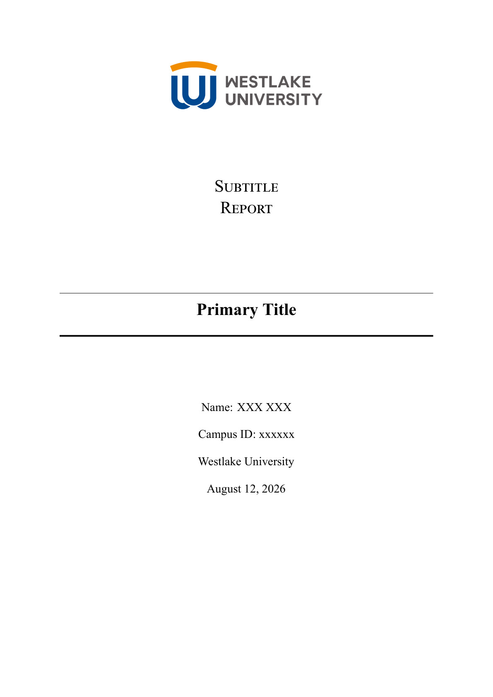

# WestlakeU-LaTeX

This repository contains LaTeX templates for creating documents related to Westlake University. The templates are designed to be user-friendly and customizable, helping you maintain a consistent and professional look across common academic documents.

## Preview

| Template | Preview |
|:--------:|:-------:|
| **📊 Beamer** |  |
| **✉️ Letter** |  |
| **🖼️ Poster** |  |
| **📝 Report** |  |

## Project Structure

```
WestlakeU-LaTeX/
├── beamer/          # Beamer presentation template
├── letter/          # Letter template
├── poster/          # Poster template
├── report/          # Report template
├── style/           # Shared style files (.sty)
├── scripts/         # Build helper scripts
├── assets/          # Logos, images, and previews
├── Makefile         # Primary build entry (Linux/macOS)
└── CHANGELOG.md     # Release notes
```

P.S. Feel free to contribute more templates!

## Requirements

- A LaTeX distribution (TeX Live, MacTeX, or MiKTeX)
- `latexmk` (usually included with TeX Live)
- XeLaTeX, Biber, and the common LaTeX packages used by the templates
- Recommended fonts: Times New Roman, Arial, Courier New, Microsoft YaHei; plus Raleway and Lato for the poster template
- A LaTeX editor (optional but recommended)
- Basic familiarity with LaTeX syntax

## Building

The primary build method is **`make`** (available on Linux/macOS and Windows via Git Bash or WSL).

```bash
cd WestlakeU-LaTeX
make          # Build all templates
make beamer   # Build a specific template
make clean    # Clean up
make help     # Show all targets
```

The raw build scripts are also available in `scripts/` — use `.\scripts\build.ps1` on Windows PowerShell, or `./scripts/build.sh` on Bash. Generated PDFs will be copied into each template directory, for example `beamer/beamer.pdf`. Temporary build files are kept under `.build/`.

## Template Usage

Each template keeps editable content in `content.tex` and project settings in `main.tex`. In most cases, you only need to:

1. Update the title, author, institute, and other metadata in `main.tex`.
2. Replace the example body in `content.tex`.
3. Put your figures under `assets/` or a local `figures/` directory and update `\includegraphics` paths.

## Acknowledgements

Special thanks to the faculty and staff at Westlake University for their valuable feedback and support throughout the development of these templates.

## Contributions

If you find any issues or have suggestions for improvements, please feel free to open an issue or submit a pull request. Contributions are always welcome!

## License

This project is licensed under the LPPL-1.3c License. See the [LICENSE](LICENSE) file for more details.
